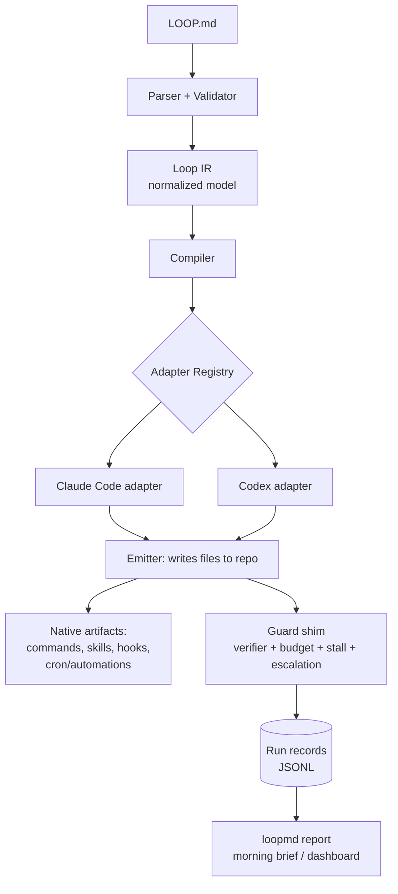
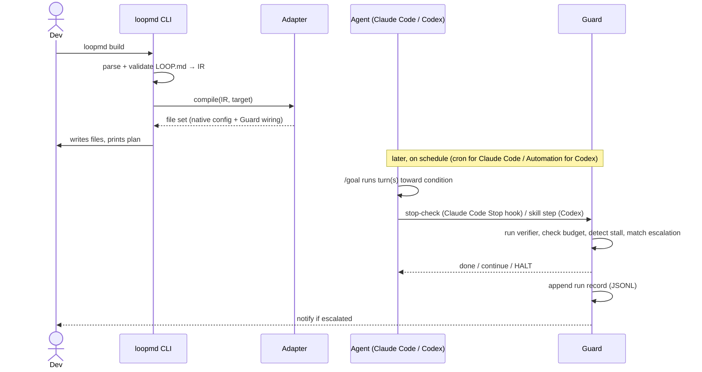

# loopmd — Technical Specification

**One-liner:** A declarative `LOOP.md` file plus a compiler (`loopmd`) that turns one readable loop definition into the *native* agent-loop wiring for **Claude Code** and **Codex** — and a shared runtime “Guard” that verifies, budgets, and reports on every run.

**Status:** Draft v0.1 · Owner: Darshan · Audience: engineering
**Scope (v1):** Claude Code and Codex only. Cursor, OpenCode, and Antigravity are deferred and added later via the adapter plugin SDK (§3.10).

-----

## 1. Overview

### 1.1 Problem

Coding agents now ship “loop” primitives (run-until-condition, scheduled runs, hooks, subagents), but each tool wires them differently and with different gaps. A developer who wants an unattended loop today must hand-author tool-specific glue — a `/goal` command + a Stop hook + a cron entry for Claude Code; an Automations entry + a skill for Codex. That glue is fiddly, non-portable, and — because it runs unattended — dangerous when it has no budget ceiling, no verifier it can’t fool, and no record of what it did.

### 1.2 Goals

1. **One spec, two targets.** Author a loop once in `LOOP.md`; compile to native artifacts for Claude Code and Codex.
1. **Ride native primitives, don’t replace them.** Both targets have native `/goal`; use it. Never re-implement an agent-driving runtime.
1. **Fill only the real gaps.** Claude Code has no native scheduler → generate one. Codex has no lifecycle hooks → run the Guard as a skill step.
1. **Safety by default.** Every generated loop carries a token budget, a verifier, stall detection, and an escalation path.
1. **Observable.** Every run emits a normalized record so a companion report can show what ran, what it cost, what it changed, and what needs a human.
1. **Local-first, OSS core, BYOK.** No telemetry leaves the machine unless the user opts into a hosted tier.

### 1.3 Non-goals

- Not a new agent runtime or a replacement for Claude Code / Codex.
- Not a hosted orchestration cloud (v1). The compiler is local; hosting is a later, optional layer.
- Not a prompt-engineering framework. `LOOP.md` defines the loop, not the model’s system prompt.

### 1.4 Design principles

- **Compiler, not wrapper.** Emit the tool’s own config; stay out of the hot path.
- **Capability-aware backends.** Each adapter declares what its tool can do natively; the emitter branches on that. (With two targets this is already load-bearing: Claude Code needs a scheduler and uses hooks; Codex has scheduling but no hooks.)
- **Single source of truth.** `LOOP.md` is the only file the user edits; generated files are disposable and reproducible.
- **The Guard is the one thing we own end-to-end.** It is identical across both targets; adapters only decide *where* it plugs in.

-----

## 2. High-Level Design (HLD)

### 2.1 Core concept

```
LOOP.md  ──parse──▶  Loop IR  ──compile──▶  [ Adapter per tool ]  ──emit──▶  native artifacts
                                                     │
                                                     └── always wires in ──▶  Guard (verify + budget + stall + escalate + record)
```

`LOOP.md` is the **interface**. `loopmd` is the **engine**. They are two halves of one product, not two products.

### 2.2 Architecture



### 2.3 Components

|Component              |Responsibility                                                                                                                                                       |
|-----------------------|---------------------------------------------------------------------------------------------------------------------------------------------------------------------|
|**Parser + Validator** |Read `LOOP.md` (YAML frontmatter + markdown sections), validate against schema, produce diagnostics.                                                                 |
|**Loop IR**            |Tool-agnostic normalized representation of a loop (goal, stop condition, verifier, budget, schedule, escalation, isolation, agent target).                           |
|**Compiler**           |Walk the IR, select adapter(s), resolve capability gaps.                                                                                                             |
|**Adapter**            |Per-tool backend. Declares a capability profile; knows how to express each IR field as that tool’s native config, or to fall back to the Guard/Scheduler.            |
|**Emitter**            |Writes generated files into the repo at deterministic paths; idempotent; never clobbers `LOOP.md`.                                                                   |
|**Guard (runtime)**    |The shared shim that runs *during* the loop: executes verifier checks, enforces token/iteration budget, detects stalls, applies escalation rules, writes run records.|
|**Scheduler (runtime)**|Synthesized only for targets without native scheduling (Claude Code): a crontab fragment or CI workflow that triggers `loopmd run <name>`.                           |
|**Report**             |Reads run records + native telemetry; renders terminal / HTML / Slack brief. Shares the run-record schema.                                                           |
|**CLI**                |`loopmd init / build / run / validate / doctor / report`.                                                                                                            |

### 2.4 Data flow (build + run)



### 2.5 Tool capability matrix (verified against current docs — see §7)

|Capability                       |Claude Code                               |Codex                               |
|---------------------------------|------------------------------------------|------------------------------------|
|Context file (markdown)          |CLAUDE.md, AGENTS.md                      |AGENTS.md                           |
|Reusable skill/command (markdown)|Skills/commands (unified)                 |Skills (`.agents/skills`)           |
|**Native run-until-condition**   |✅ `/goal` (small-model Stop-hook verifier)|✅ `/goal`                           |
|**Native scheduling**            |❌ external cron / GitHub Actions          |✅ Automations (cadence)             |
|Lifecycle hooks                  |✅ Stop & other hooks                      |❌ (approval modes / guardrails only)|
|Headless / scriptable            |`claude -p` (`--output-format json`)      |Agents SDK + CLI                    |
|Worktree isolation               |✅ `isolation: worktree`                   |✅ worktree or local                 |
|Budget cap                       |`--tokens`                                |per-automation                      |
|Telemetry source (for report)    |`~/.claude/projects/*.jsonl`              |traces dashboard / export           |

**Implication:** the IR is constant; the two adapters differ in exactly two ways. Claude Code needs a **generated Scheduler** (no native cron) and wires the Guard as a **Stop hook**. Codex uses its **native Automations** for scheduling and — because it has no hooks — runs the Guard as a **step inside the skill**. No run-until-condition synthesis is needed in v1 because both targets ship `/goal`.

### 2.6 Deployment / packaging

- **v1:** single npm package `loopmd` (Node CLI), optional `pip install loopmd` thin wrapper. The Guard ships as a tiny zero-dependency script (Node + a `/bin/sh` fallback) so it runs inside hooks and CI without extra installs.
- Generated artifacts are committed to the user’s repo (reviewable, reproducible).
- **Hosted (later):** a service that ingests run records for team history and audit trails. Out of scope for v1.

-----

## 3. Low-Level Design (LLD)

### 3.1 `LOOP.md` schema

YAML frontmatter (machine fields) + markdown sections (human-readable intent), parsed by heading.

```markdown
---
name: nightly-ci-triage          # required, kebab-case, unique per repo
version: 1                        # schema version
agent: claude-code               # required: claude-code | codex | [claude-code, codex]
schedule: "0 2 * * *"            # cron expr | "manual" | "on-merge" (CI trigger)
budget:
  tokens: 150000                 # hard ceiling; loop halts when exhausted
  iterations: 20                 # max turns
  wall_clock: "45m"             # optional time ceiling
isolation: worktree              # worktree | inplace
model: default                   # optional model hint; "default" = tool default
notify:
  on: [escalate, fail, done]     # which events ping the user
  channel: "slack:#eng-loops"   # slack:<chan> | email:<addr> | desktop | stdout
---

## Goal
Triage failing CI from the last 24h and open a draft PR per fix.

## Stop when
All tests in `test/` pass and lint is clean.

## Verify with
- run: npm test
- run: npm run lint
- file_exists: coverage/lcov.info        # optional structured checks

## Escalate to me if
- touches: ["auth/**", "billing/**"]
- repeats: { same_diff: 2 }               # same change proposed twice
- repeats: { test_fail: 3 }               # one test fails 3x
- budget_exceeded: true                   # implied, listed for clarity

## Context                                 # optional; merged into CLAUDE.md / AGENTS.md
- We use pnpm; npm is aliased.
- Never touch the generated/ directory.
```

**Section → IR mapping:** `## Goal` → `goal`; `## Stop when` → `stopCondition` (natural language, handed to native `/goal`); `## Verify with` → `verifiers[]` (structured, run by the Guard); `## Escalate to me if` → `escalation[]`; `## Context` → `context[]` (emitted into CLAUDE.md / AGENTS.md).

### 3.2 Loop IR (normalized model)

```typescript
type AgentTarget = "claude-code" | "codex";   // extended via plugins post-v1

interface Verifier {
  kind: "run" | "file_exists" | "http_ok" | "exit_zero" | "custom";
  cmd?: string;            // for run/exit_zero
  path?: string;           // for file_exists
  url?: string;            // for http_ok
  any?: boolean;           // default false = all must pass
}

interface Escalation {
  touches?: string[];                       // glob paths that require a human
  repeats?: { same_diff?: number; test_fail?: number };
  budget_exceeded?: boolean;
  on_irreversible?: boolean;                // force-push, file delete, prod call
}

interface Budget { tokens?: number; iterations?: number; wallClock?: string; }

interface Schedule { kind: "cron" | "manual" | "event"; expr?: string; event?: string; }

interface LoopIR {
  name: string;
  version: number;
  targets: AgentTarget[];
  goal: string;
  stopCondition: string;          // natural language → native /goal
  verifiers: Verifier[];          // structured → Guard-executed
  escalation: Escalation[];
  budget: Budget;
  schedule: Schedule;
  isolation: "worktree" | "inplace";
  model: string;
  context: string[];
  notify: { on: ("escalate"|"fail"|"done")[]; channel: string };
}
```

### 3.3 Adapter contract + capability profile

```typescript
interface CapabilityProfile {
  nativeGoal: boolean;        // tool can run-until-condition itself
  nativeSchedule: boolean;    // tool can schedule recurring runs
  nativeHooks: boolean;       // tool exposes lifecycle hooks (for the Guard)
  worktrees: boolean;
  headlessCmd: string | null; // e.g. "claude -p"
  telemetry: "jsonl" | "traces";
}

interface EmittedFile { path: string; content: string; mode?: number; }

interface Adapter {
  target: AgentTarget;
  capabilities(): CapabilityProfile;
  compile(ir: LoopIR, ctx: CompileContext): EmittedFile[];
}
```

**Gap-resolution rules (compiler):**

- `nativeSchedule === false` (Claude Code) → emit a **Scheduler** (crontab fragment, or a CI workflow when `schedule.kind === "event"`).
- `nativeHooks === false` (Codex) → wire the **Guard as a skill step** rather than as an in-loop hook.
- `nativeGoal === false` → would emit a synthesized **Runner**. *Not exercised in v1* (both targets are native-goal); kept in the contract for plugin adapters added later.

Profiles for v1:

```
claude-code: { nativeGoal: true,  nativeSchedule: false, nativeHooks: true,  worktrees: true, headlessCmd: "claude -p", telemetry: "jsonl"   }
codex:       { nativeGoal: true,  nativeSchedule: true,  nativeHooks: false, worktrees: true, headlessCmd: "codex",     telemetry: "traces" }
```

### 3.4 Per-tool adapters — what each emits

#### 3.4.1 Claude Code (`nativeGoal: true, nativeSchedule: false, nativeHooks: true`)

- `.claude/commands/<name>.md` — a skill/command wrapping the goal prompt + context.
- `.claude/hooks/<name>-verify.sh` — a **Stop hook** that invokes the Guard; the Guard runs `verifiers[]` and returns done/continue/HALT. (Native `/goal` self-checks via its small-model verifier; the Guard adds the *structured* checks `/goal` can’t run, plus budget/stall/escalation.)
- `crontab.d/<name>` or `.github/workflows/loopmd-<name>.yml` — runs `claude -p "/goal <stopCondition>" --tokens <budget.tokens>` with `isolation: worktree`.
- Context merged into `CLAUDE.md` (managed block).
- Telemetry: report reads `~/.claude/projects/*.jsonl`.

#### 3.4.2 Codex (`nativeGoal: true, nativeSchedule: true, nativeHooks: false`)

- `.agents/skills/<name>/SKILL.md` — the goal + a final step `run: loopmd guard --loop <name>` (since Codex has no Stop hooks, the Guard runs inside the skill).
- `loopmd/<name>.codex-automation.json` + printed setup instructions — Automations are created in-app, so loopmd emits the descriptor (project, prompt = invoke skill + `/goal <stopCondition>`, cadence = `schedule`, environment = worktree|local) and `doctor` walks the user through registering it.
- Context → `AGENTS.md` (managed block).
- Note: Automations currently execute on the developer’s machine (cloud scheduling rolling out); `doctor` warns if the machine may sleep.
- Telemetry: report reads the Codex traces export.

### 3.5 The Guard (runtime shim) — the piece we own

The Guard is a single small script invoked either as a Claude Code Stop hook or as a Codex skill step. It is **identical for both targets** and unifies the original ideas (report, circuit-breaker, verifier-registry) into one runtime.

**Responsibilities per invocation:**

1. **Verify:** run each `Verifier`; return aggregate pass/fail. The “something that can say no.”
1. **Budget:** read tokens-so-far + iteration count; if `>= budget`, return `HALT(reason=budget)`.
1. **Stall-detect:** hash the proposed diff; if `same_diff` repeats `n` times, or a verifier fails `n` times, return `HALT(reason=stall)`.
1. **Escalate:** if a changed path matches `escalation.touches`, or an irreversible action is detected (force-push, delete, prod call), return `HALT(reason=escalate)` and notify.
1. **Record:** append a normalized run-record.
1. **Decide:** return `DONE` (stopCondition + verifiers satisfied), `CONTINUE`, or `HALT`.

**Run-record schema (JSONL, shared with the report):**

```typescript
interface RunRecord {
  loop: string;
  runId: string;
  target: AgentTarget;
  startedAt: string; endedAt: string;
  iterations: number;
  tokens: { input: number; output: number; total: number };
  costUsd?: number;
  outcome: "done" | "halted" | "failed" | "escalated" | "running";
  haltReason?: "budget" | "stall" | "escalate" | "error";
  verifiers: { name: string; passed: boolean; durationMs: number }[];
  diffsTouched: string[];
  irreversibleActions: string[];
  prUrl?: string; ticket?: string;
  needsHuman: boolean;
}
```

The report (`loopmd report`) consumes `~/.loopmd/records/*.jsonl` and enriches with native telemetry (Claude Code JSONL; Codex traces) to render the brief.

### 3.6 CLI surface

|Command                                                 |Behavior                                                                                                                           |
|--------------------------------------------------------|-----------------------------------------------------------------------------------------------------------------------------------|
|`loopmd init`                                           |Interactive scaffold: ask goal/stop/verify/schedule/agent → write a starter `LOOP.md`.                                             |
|`loopmd build [--target claude-code|codex]`             |Parse → IR → compile → emit native files. Multi-target if frontmatter lists both. Idempotent; prints a plan/diff.                  |
|`loopmd run <name>`                                     |Manually trigger a loop now (also called by the generated scheduler).                                                              |
|`loopmd guard --loop <name>`                            |Runtime entrypoint that hooks/skill-steps call. Not usually run by hand.                                                           |
|`loopmd validate`                                       |Schema + feasibility check (e.g. “Codex Automations must be registered in-app; run `doctor`”).                                     |
|`loopmd doctor`                                         |Environment checks: tool versions, `/goal` availability, Codex Automation registration, machine-sleep warnings, credential scoping.|
|`loopmd report [--since 24h] [--format term|html|slack]`|Render the brief from run records.                                                                                                 |

### 3.7 Generated file layout (example, `agent: [claude-code, codex]`)

```
repo/
├─ LOOP.md                       # user-authored, source of truth
├─ CLAUDE.md                     # context merged in (managed block)
├─ AGENTS.md                     # context merged in (managed block)
├─ .claude/
│  ├─ commands/nightly-ci-triage.md
│  └─ hooks/nightly-ci-triage-verify.sh   # calls `loopmd guard`
├─ .agents/skills/nightly-ci-triage/SKILL.md   # ends with `loopmd guard` step
├─ .github/workflows/loopmd-nightly-ci-triage.yml   # Claude Code scheduler
└─ loopmd/
   ├─ nightly-ci-triage.codex-automation.json       # Codex automation descriptor
   ├─ generated.lock             # hash of LOOP.md → detect drift
   └─ records/                   # (gitignored) run records
```

A managed-block convention (`<!-- loopmd:start name -->` … `<!-- loopmd:end -->`) lets the emitter update its sections of shared files without touching hand-written content.

### 3.8 Telemetry & the report (companion)

- The Guard is the universal source: it writes a `RunRecord` regardless of target, so the report works even before native telemetry is parsed.
- Enrichment: Claude Code JSONL gives per-skill token attribution; Codex traces give the turn-by-turn timeline.
- Output: terminal table (default), single-file HTML (shareable), Slack digest (team).

### 3.9 Security model

The compiler writes code that *executes* (hooks, cron, skill steps), so:

- **Least privilege:** generated artifacts request only the tools the IR implies.
- **No credential capture:** the Guard never logs env vars/secrets; diffs are path-only by default (content opt-in).
- **Irreversible-action gating:** force-push, deletion, and non-allowlisted outbound calls trigger escalation, not silent execution.
- **Reviewable output:** everything is committed plaintext; `generated.lock` detects drift; `loopmd build` shows a diff before writing.
- **Budget mandatory:** `build` refuses to emit a loop with no token/iteration ceiling unless `--force`.

### 3.10 Extensibility

- Adapters are plugins resolved from `loopmd-adapter-<name>` packages. **Cursor, OpenCode, and Antigravity ship post-v1 via this SDK** — including the synthesized-Runner path in §3.3 for tools without native `/goal`.
- Verifiers are pluggable by `kind`; a community registry (`loopmd-verifier-*`) supplies new check types (screenshot-diff, eval-threshold, API-contract).
- The IR is versioned; `LOOP.md` carries `version` for forward-compat.

-----

## 4. Tech stack

- **Language:** TypeScript (Node 20+) — both targets ship JS/TS SDKs; keeps the Guard dependency-light.
- **Parsing:** `gray-matter` (frontmatter) + a small heading splitter; `zod` for schema validation.
- **Guard:** single-file, zero-runtime-dependency TS compiled to a standalone script (+ a `/bin/sh` micro-fallback for hook contexts without Node).
- **Distribution:** `npm i -g loopmd`; `npx loopmd` for zero-install; optional `pip` shim.

## 5. Phasing

- **MVP (week 1–2):** `LOOP.md` schema + parser + IR + **Claude Code adapter** + Guard (verify + budget + stall + escalate + record) + `loopmd report` (terminal). One tool, end-to-end, with a demo GIF.
- **v0.2:** **Codex adapter** — proves the no-hooks path (Guard-as-skill-step) and native Automations scheduling.
- **v0.3:** HTML/Slack report; `doctor`; managed-block updates.
- **v1:** adapter + verifier plugin SDKs (the on-ramp to Cursor / OpenCode / Antigravity); docs site.

## 6. Risks

- **Native primitives move fast.** `/goal` and Automations change. Mitigation: adapters emit *config*, not runtime wrappers, so a change is a localized adapter patch. `doctor` pins tested version ranges.
- **Vendors converge on cross-tool compat** (Codex already imports Claude Code setup). Mitigation: the value is the *Guard* (safety + reporting), not portability — lean there.
- **Cold-start / demand.** Not everyone runs loops yet. Mitigation: the report works on *any* agent session, not just loops, so it’s useful before loops are mainstream; the scaffolder is the on-ramp.
- **Scaffold niche has an early entrant** (loop-init / readiness-score). Mitigation: differentiate on native emission + the Guard/report tie-in, not “another init.”
- **Security blast radius.** Generating executable hooks/cron is high-trust. Mitigation: §3.9.

## 7. References (capabilities verified against current docs)

- Claude Code `/goal` (Stop-hook verifier, small fast model), `/loop`, headless `claude -p`: code.claude.com/docs/en/goal; docs.anthropic.com/…/sdk-headless
- Codex Automations (project/prompt/cadence/worktree), `/goal`, AGENTS.md, skills: developers.openai.com/codex/learn/best-practices; developers.openai.com/codex/guides/agents-md

*Capabilities are current as of June 2026 and will drift; treat `doctor` as the source of truth at runtime.*